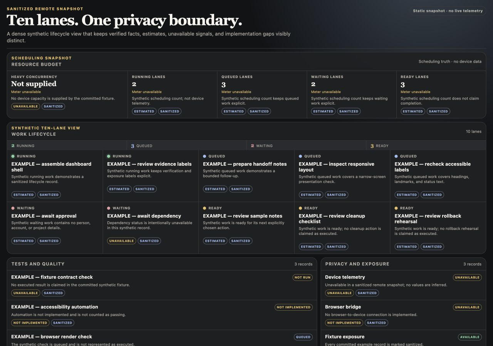
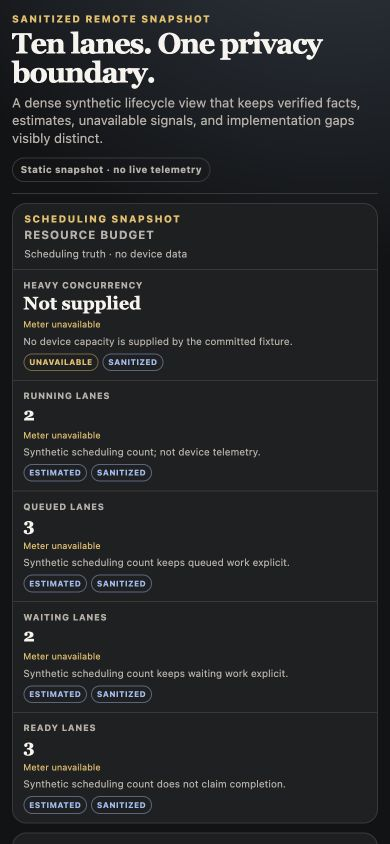
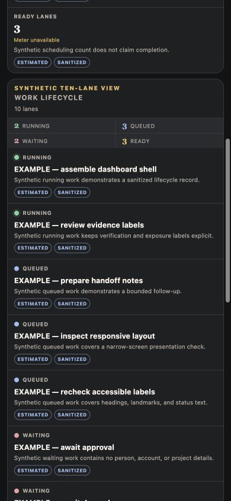
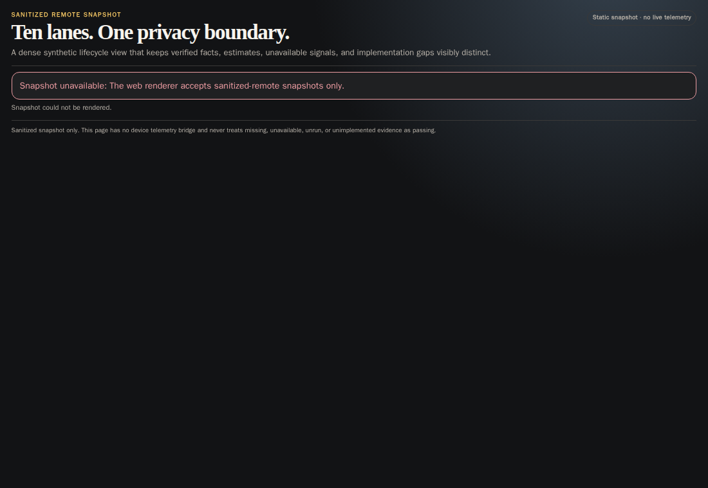

# Web dashboard state and evidence

## State flow

```text
static synthetic fixture
        |
        v
one-shot same-origin fetch
        |
        v
strict schema + privacy validation
        |
        +-- invalid --> visible error banner; dashboard content stays hidden
        |
        +-- valid ----> resource cards
                      + ten lifecycle lanes
                      + tests and quality
                      + privacy and exposure
```

There is no refresh loop, device agent, telemetry collector, socket, or
browser-to-workstation route. Lifecycle records retain the contract states
`running`, `queued`, `waiting`, and `ready`; exposure and verification remain
separate attributes.

## Acceptance walkthrough

Desktop at 1280 by 900:



- Five compact resource cards stay above the lifecycle view.
- Ten synthetic lifecycle cards form two rows of five.
- Tests and privacy signals remain visible below the lifecycle cards.
- Missing capacity is labeled `Not supplied` and `Meter unavailable`.

Narrow screen at 390 by 844:



The narrow lifecycle continuation:



- The masthead and section headings wrap without horizontal overflow.
- Resource and lifecycle cards collapse to one column.
- The four lifecycle totals remain a readable two-by-two grid.

## Failure, retry, rollback, and cleanup



- **Failure:** an invalid mode, unknown field, non-sanitized record, private-looking
  string, or out-of-range optional metric produces a visible error banner and
  keeps all dashboard regions hidden.
- **Retry:** correct the offline source, rebuild the content-addressed bundle,
  and reload the static page. The renderer itself does not retry or poll.
- **Rollback:** activate the prior verified immutable publication as documented
  in `../../operations-dashboard/PUBLISHING.md`; no browser state migration is
  required.
- **Cleanup:** stop the local static server and remove task-local publication
  and browser-artifact directories. No device service or credential remains.

## Verification scope

The evidence frames use only the committed synthetic fixture. Unit checks cover
strict input validation, future-compatible optional queue metrics, explicit
missing evidence, injection-safe text rendering, and responsive structure.
Browser checks cover rendered counts, narrow-screen overflow, error behavior,
keyboard focus sanity, console/page errors, injection-shaped text, and
contract-maximum unbroken strings. `tests/browser-smoke.mjs` makes those checks
reproducible in a pinned Playwright container.

Video is N/A because this opt-in static reference does not provide a named,
Dockerized release-cut harness.
