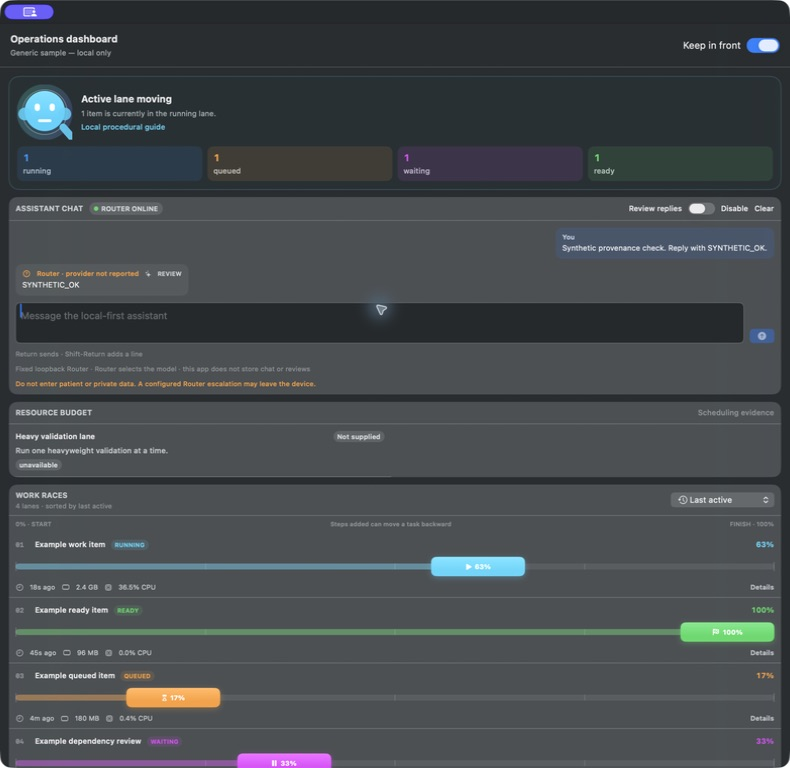
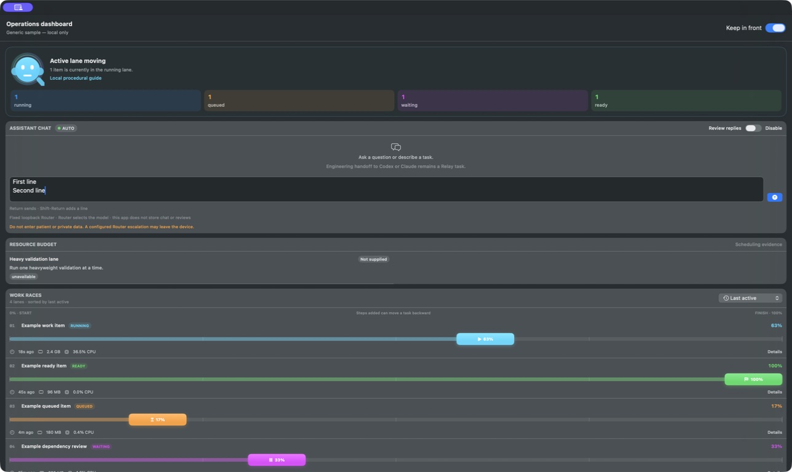

# Chat composer and responder state map

The native assistant composer uses a true multiline text area. This keeps
message submission distinct from editing:

```text
editable draft
├─ Shift-Return ─> insert newline ─> editable draft
└─ Return ───────> can send?
                   ├─ yes ─> submit bounded draft ─> clear composer
                   └─ no  ─> keep draft unchanged
```

| Input | Result |
|---|---|
| Return with a non-empty ready draft | Sends the draft and clears the composer |
| Shift-Return | Inserts a newline and makes no Router request |
| Return while disabled, empty, or already sending | Makes no request and retains any draft |
| Send button or Command-Return | Uses the same bounded send path |

Responder identity is immutable per assistant bubble and comes only from the
bounded completion response:

```text
completion response
├─ responder kind/provider says Anthropic or Claude ─> Claude
├─ responder kind/provider/model says Codex ─────────> Codex
├─ responder kind/provider says local/Ollama/MLX ────> Local LLM
├─ another provider is reported ─────────────────────> Router · <provider>
└─ no provider identity; model is auto ──────────────> Router · provider not reported
```

The top status capsule reports only Router reachability. It does not present
`auto` as a model or responder identity. Optional malformed provenance is
ignored without hiding an otherwise valid answer; missing provenance remains
visibly unreported.

## Rebuilt-app evidence

The rebuilt Release frame below uses only synthetic text. The live loopback
Router returned `model: "auto"` without provider metadata, so the assistant
bubble visibly and correctly says **Router · provider not reported** while the
top capsule says only **Router online**.



The earlier composer frame shows the multiline draft after typing `First line`,
pressing Shift-Return, and typing `Second line`; no message had been sent when
that frame was captured.



The live acceptance path then pressed Return and observed one two-line user
message plus an empty composer. The retry path disables or clears chat, both of
which cancel in-flight work and remove the in-memory conversation.
