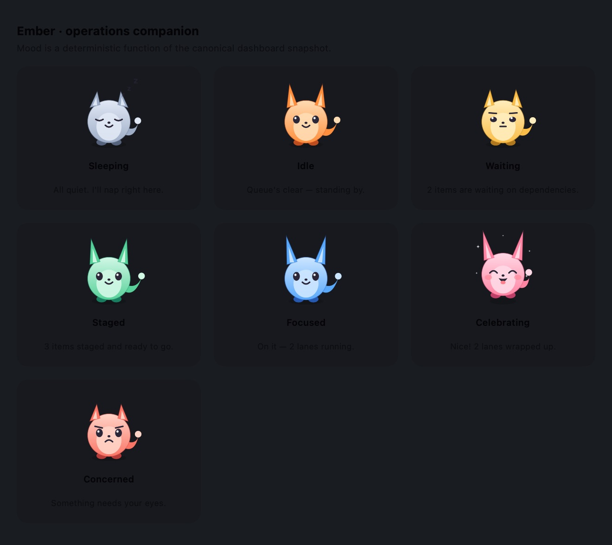
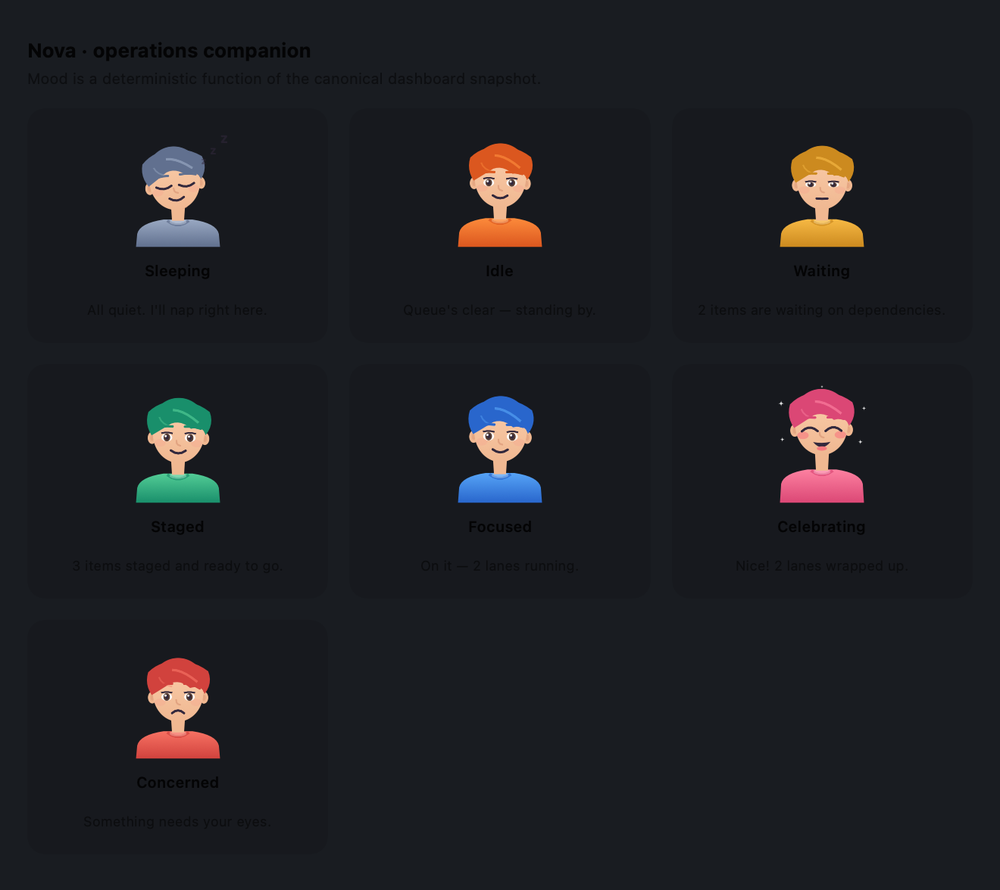

# Operations companion ("Ember" / "Nova")

The operations companion is a small, charming on-screen figure that lives in the
bottom-trailing corner of the dashboard. It gives the operations floater a
friendly, glanceable "face" for the same canonical state the rest of the surface
already shows, and nothing more. It is a presentation-only feature: it reads the
snapshot, never writes it, and performs no control-plane action.

It ships in **two switchable styles** that share one state machine:

- **Ember** (`.pet`) — a vector-drawn fox-kit.
- **Nova** (`.human`) — a warm, stylized human assistant.

Both are driven by the *exact same* mood/pose/motion pipeline; only the drawing
differs, so switching between them is a pure presentation choice with no
behavioral change. See [Choosing a style](#choosing-a-style).

Ember (pet):



Nova (human):



## What it reacts to

The companion's mood is a deterministic function of the canonical
`DashboardSnapshot` (reusing the already-tested `guideCue` classification) plus
one short, time-boxed celebration transient. No mood is derived from any image,
camera, microphone, network, analytics, or personal source.

| Dashboard state (highest priority first)                              | Mood          | Behavior                                                        |
| --------------------------------------------------------------------- | ------------- | -------------------------------------------------------------- |
| Verified failure, verified attention signal, or pending owner decision | `concerned`   | Drooped ears, worried brow, frown                              |
| A queue item just entered the finished (`ready`) lane                 | `celebrating` | Happy squint, open grin, blush, sparkles, a little hop (6 s)   |
| One or more lanes `running`                                           | `focused`     | Ears perked up, wide alert eyes, faster tail                   |
| Work `ready`/`queued` with nothing running                            | `staged`      | Ears up, content smile                                         |
| Items `waiting` on a dependency                                       | `waiting`     | Ears drooped, flat mouth                                       |
| Records exist but the queue is calm                                   | `idle`        | Gentle breathing and blinking                                 |
| No records at all                                                     | `sleeping`    | Closed eyes and a soft "z z z"                                 |

Concern always wins over a celebration, and a celebration never starts while the
companion is concerned — you never see the companion cheering while something is
on fire. The celebration is triggered only when the finished-lane count strictly
increases relative to the previous snapshot, so pre-existing finished work on
launch does not celebrate.

The status bubble restates only canonical lane counts (for example, "On it — 2
lanes running." or "3 items staged and ready to go.").

## Personality and motion

- Idle breathing and a deterministic blink.
- Ears perk up with focus and droop with concern or fatigue; a small twitch
  keeps them alive.
- A tail that wags faster the busier the queue is.
- Celebration sparkles and a hop; concerned brows and a frown.

Motion is a pure function of `(time, mood)`. **Reduce Motion produces a fully
stable frame** (open eyes, no bob, no hop), matching the existing guide avatar.

Nova reinterprets the same pose/motion fields for a human silhouette without
touching the state machine: `earLift` becomes a forward **lean** (perked → leans
in when focused/staged/celebrating; drooped → withdraws when waiting/concerned/
sleeping), `tailEnergy × tailSway` becomes a subtle live head sway, `browAngle`
knots the inner brows, and `eyeOpenness`/`happyEyes`/`sleeping` drive eyelids,
smiling squints, and resting arcs. Each mood therefore reads as a distinct human
expression — breathing/blinking idle, lean-in focused, warm open-grin
celebrating, worried-brow concerned, eyes-closed sleeping — and Reduce Motion is
stable for Nova too.

## Choosing a style

The active style persists via `AppStorage`/`UserDefaults` under
`OperationsFloater.CompanionStyleV1` (default: `pet`). Switch it live from the
app menu — **Operations Floater ▸ Companion Style ▸ Ember (pet) / Nova (human)** —
which writes that key; the dashboard observes it and re-renders the companion
immediately, no restart required.

## Non-intrusive by design

- It sits in the corner with padding and only occupies its own footprint, so the
  rest of the dashboard stays interactive.
- It is **dismissible**: hovering reveals a close control that collapses the
  companion to a small wake button; the choice persists across launches via
  `AppStorage` (`OperationsFloater.CompanionDismissedV1`).
- It draws with SwiftUI `Canvas`, so it needs no external art asset.

## Files

| File                                        | Responsibility                                                              |
| ------------------------------------------- | --------------------------------------------------------------------------- |
| `Sources/OperationsFloater/CompanionPresentation.swift` | Pure, UI-free state machine: the `CompanionStyle` selector, mood mapping, celebration reducer, poses, motion sampler, and status chatter. |
| `Sources/OperationsFloater/CompanionView.swift`         | SwiftUI: `CompanionCharacter` (dispatches on style), the vector-drawn pet `Canvas`, live corner overlay, speech bubble, dismiss/wake control, mood gallery, and headless PNG renderer. |
| `Sources/OperationsFloater/CompanionHumanView.swift`    | SwiftUI: `CompanionHumanArt`, the vector-drawn human ("Nova") `Canvas` renderer, consuming the same `(pose, frame)`. |
| `Tests/OperationsFloaterTests/CompanionPresentationTests.swift` | State-machine, pose, motion, and chatter tests.                    |
| `Tests/OperationsFloaterTests/CompanionStyleTests.swift` | Style selector, persistence round-trip, style-aware naming, and preview-argument parsing tests. |

The controller is wired into `DashboardView` in `OperationsFloaterApp.swift`; it
ingests each new snapshot and the pending-decision flag, and the effective mood
is recomputed at render time so the celebration decays smoothly without an extra
timer.

## Preview and tests

```bash
# State-machine, pose, motion, and chatter tests, plus the style-selector tests.
swift test --filter CompanionPresentationTests
swift test --filter CompanionStyleTests

# Headless still-frame gallery of every mood (offscreen rasterization; no window
# is foregrounded). The optional --companion-style flag defaults to the pet.
swift run OperationsFloater --render-companion-preview /tmp/ember-gallery.png
swift run OperationsFloater --render-companion-preview /tmp/nova-gallery.png --companion-style human
```

Xcode canvas `#Preview`s for the Ember gallery, the Nova gallery, and the live
corner companion are included at the bottom of `CompanionView.swift`.
