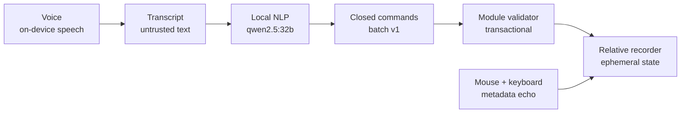
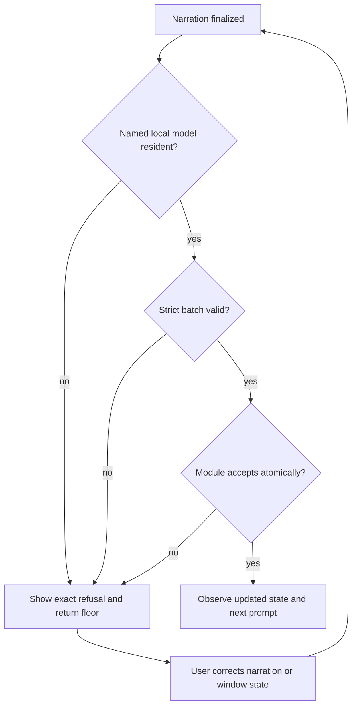

# Recorder live trace

The Relative XY recorder keeps the user-facing pipeline visible while a module
owns the conversation floor:

The native panel renders these same stages in real time. It shows the exact
heard transcript, the normalized closed commands, the recorder state before
and after the turn, the selected-window dimensions, accepted event count,
normalizer model, and the module result. A refusal remains visible at the stage
that rejected it instead of being flattened into a generic chat error.

The normalization boundary is deliberately narrow:

- the transcript and recorder question are JSON-encoded as untrusted data;
- the local Router request names `qwen2.5:32b` explicitly;
- the response must be exactly `relative-xy-command-batch/v1`;
- only `start`, `pause`, `resume`, `stop`, `container`, `target`, `anchor`, and
  `show-layout` commands are accepted;
- unknown fields, executable-looking values, extra prose, missing local-model
  residency, and malformed output fail closed;
- the recorder validates the batch again and applies all commands
  transactionally.

The recorder event echo is confidence evidence, not a replay surface. It shows
accepted pointer coordinates normalized to the selected window, button and
scroll metadata, and keyboard phase/key code/modifiers with elapsed time.
Printable characters are never reconstructed. Events excluded because the
selected window is no longer active or topmost increment the visible excluded
counter.

Dashboard cards are collapsible from their headers. Their states persist
locally. Hidden cards are removed from the view tree; collapsing Assistant Chat
also stops voice, cancels pending work, revokes the conversation floor, and
clears ephemeral transcript and recorder state. Snapshot polling stops when
all snapshot-dependent cards are collapsed.

Operations Floater now opens on one macOS Space. It no longer opts into
`canJoinAllSpaces`, which previously mirrored the same window on every Desktop.
Moving the window to another Desktop remains an ordinary user-controlled macOS
action.

## Failure and retry map

Video is N/A for this change because the repository does not provide a named,
Dockerized Operations Floater release-cut target. The rebuilt native app and
deterministic Swift tests provide the visual and state-transition evidence.
