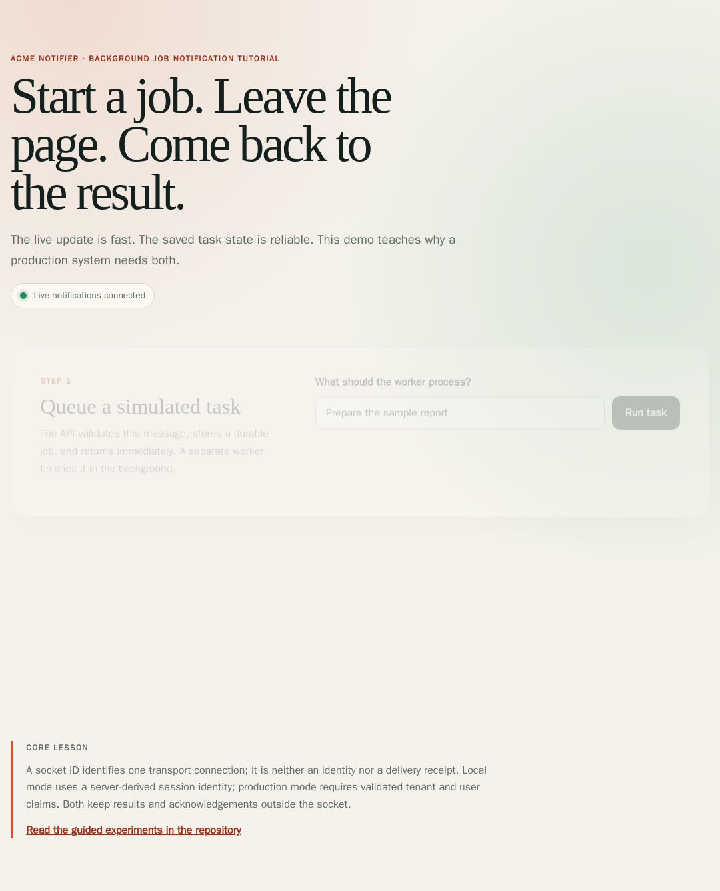
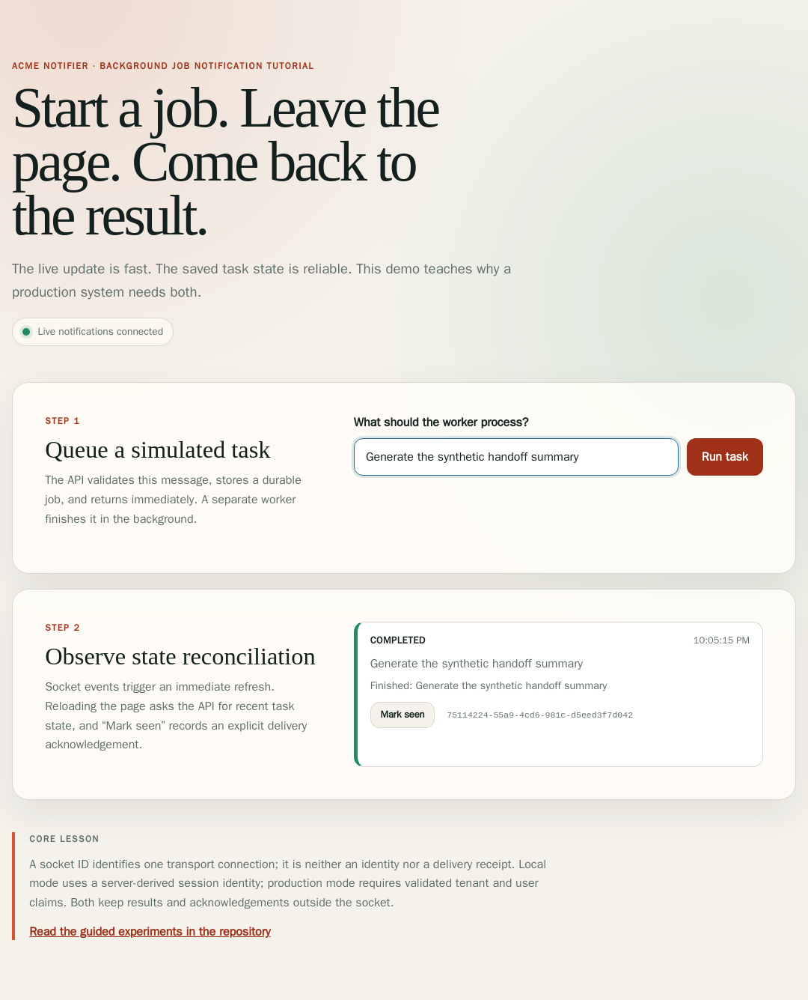
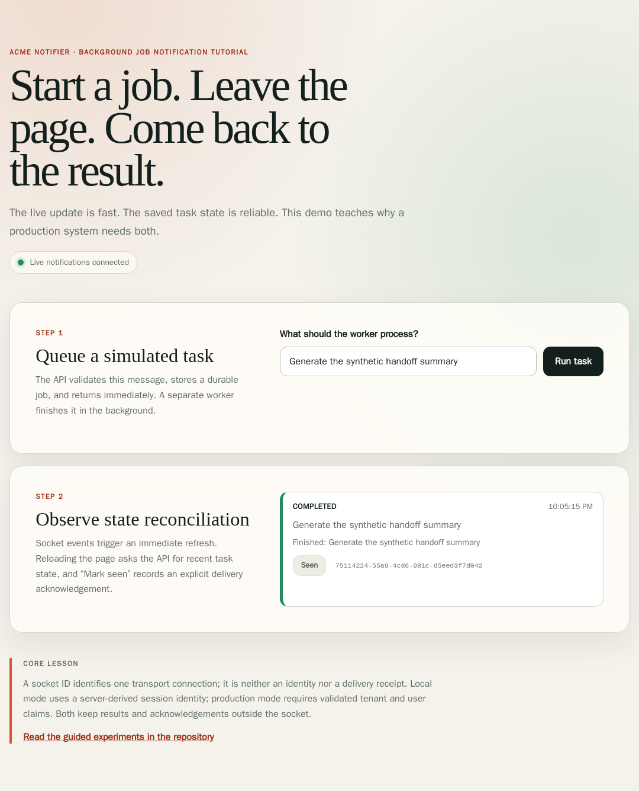

# {{ project_name }} — Storyboard (planned vs implemented)

> Auto-generated from real screenshots by `make storyboard`. The manifest
> is the plan; the assertions and rebuilt app are the implementation evidence.

**Legend:** ✅ Implemented · 🚧 Partial / externally blocked · ⬜ Planned · 🔄 Changed / simplified

**Status:** ✅ 4 done · 🚧 0 partial · ⬜ 1 planned · 🔄 0 changed

---

## v0.1 — Durable notification slice

_The socket is a hint; Redis-backed task state and acknowledgement are authoritative._

### Browser lifecycle

| Screen | Preview | Status | Story | Notes |
|---|---|---|---|---|
| Ready lab |  | ✅ done | The browser establishes a local identity and a live update channel. | Fresh state is explicit; no completed task is invented. |
| Queued or running |  | ✅ done | POST returns 202 with a task id while a separate worker owns execution. | The UI renders authoritative task state after creation. |
| Completed |  | ✅ done | A socket hint triggers reconciliation, and the saved result survives refresh. | Terminal state comes from GET /api/tasks/:id. |
| Acknowledged |  | ✅ done | The client records an idempotent terminal acknowledgement. | The receipt proves an authorized API call, not human understanding. |

### Production boundary

| Screen | Preview | Status | Story | Notes |
|---|---|---|---|---|
| OIDC deployment | — | ⬜ planned | Use a validated external tenant and subject plus TLS/ACL Redis. | Owner-gated: this scaffold neither provisions nor deploys production infrastructure. |
